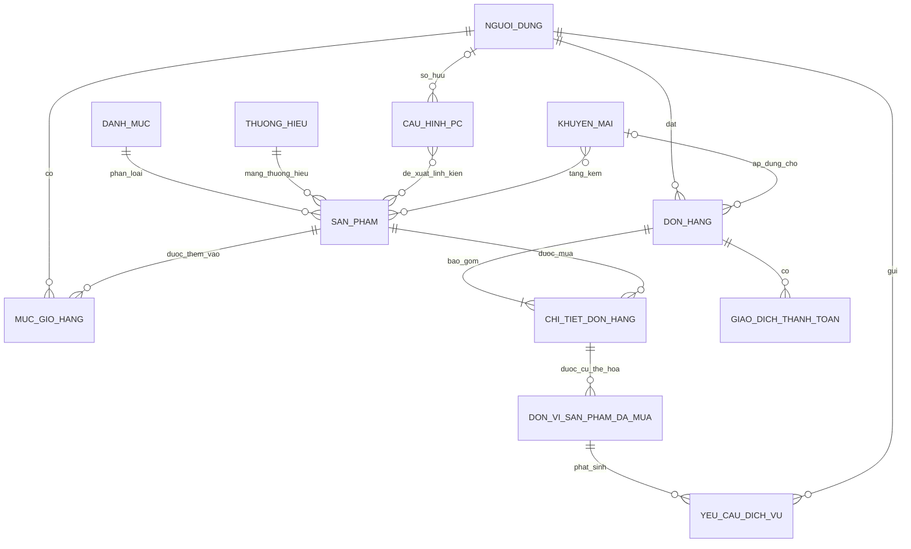

# PCForge — Mô hình cơ sở dữ liệu mức khái niệm (Conceptual ERD)

*Dựa trên file PCForge_Core12_Database.txt*

Hệ thống PCForge: bán linh kiện máy tính, đề xuất cấu hình PC bằng AI, quản lý bảo hành/bảo trì.

Ở mức conceptual, mô hình tập trung vào thực thể nghiệp vụ và quan hệ giữa chúng, không thể hiện kiểu dữ liệu, khóa ngoại hay cách lưu JSON.

---

## 1. Các thực thể chính

| Thực thể | Tên trong database |
|---|---|
| Người dùng | users |
| Danh mục | categories |
| Thương hiệu | brands |
| Sản phẩm | products |
| Mục giỏ hàng | cart_items |
| Đơn hàng | orders |
| Chi tiết đơn hàng | order_items |
| Giao dịch thanh toán | payments |
| Khuyến mãi | promotions |
| Cấu hình PC | pc_builds |
| Đơn vị sản phẩm đã mua | purchased_units |
| Yêu cầu bảo hành/bảo trì | service_requests |

**Phân biệt quan trọng:** Sản phẩm là một loại hàng được bán; đơn vị sản phẩm đã mua là từng món cụ thể. Ví dụ, một dòng đơn hàng mua 2 thanh RAM sẽ tương ứng với 2 đơn vị sản phẩm để theo dõi bảo hành riêng.

---

## 2. Sơ đồ Conceptual ERD (Mermaid)

**Ký hiệu:**
- `||` : đúng một.
- `o|` : không có hoặc có một.
- `o{` : không có hoặc có nhiều.
- `|{` : có ít nhất một.

**Lưu ý về cách đọc mô hình:** Sơ đồ thể hiện ý nghĩa nghiệp vụ dự kiến: mỗi sản phẩm thuộc một danh mục và một thương hiệu; mỗi đơn hàng hợp lệ có ít nhất một dòng hàng. File chưa khai báo NOT NULL cho nhiều khóa ngoại nên các ràng buộc bắt buộc này cần được xác nhận khi triển khai.

Hai quan hệ **Cấu hình PC – Sản phẩm** và **Khuyến mãi – Sản phẩm** là quan hệ nghiệp vụ; bản Core12 đang lưu chúng bằng JSON, không có FK trực tiếp.

---

## 3. Diễn giải các mối quan hệ

| Mối quan hệ | Bội số |
|---|---|
| Người dùng — Mục giỏ hàng | 1–N |
| Sản phẩm — Mục giỏ hàng | 1–N |
| Danh mục — Sản phẩm | 1–N |
| Thương hiệu — Sản phẩm | 1–N |
| Người dùng — Đơn hàng | 1–N |
| Đơn hàng — Chi tiết đơn hàng | 1–N |
| Sản phẩm — Chi tiết đơn hàng | 1–N |
| Đơn hàng — Giao dịch thanh toán | 1–N |
| Khuyến mãi — Đơn hàng | 1–N |
| Người dùng — Cấu hình PC | 1–N, tùy chọn phía người dùng |
| Cấu hình PC — Sản phẩm | N–N |
| Khuyến mãi — Sản phẩm | N–N |
| Chi tiết đơn hàng — Đơn vị sản phẩm đã mua | 1–N |
| Đơn vị sản phẩm đã mua — Yêu cầu dịch vụ | 1–N |
| Người dùng — Yêu cầu dịch vụ | 1–N |

---

## 4. Các quy tắc nghiệp vụ chính

- **Giỏ hàng:** mỗi cặp người dùng – sản phẩm là duy nhất; thay đổi số lượng trên cùng một mục giỏ.
- **Đơn hàng:** lưu địa chỉ giao hàng và tên/giá sản phẩm tại thời điểm mua để giữ lịch sử.
- **Thanh toán:** hỗ trợ COD và VNPay; một đơn có thể có nhiều lần thử thanh toán. Phạm vi hiện tại hỗ trợ hoàn tiền toàn bộ giao dịch, chưa hỗ trợ đổi trả một phần.
- **Khuyến mãi:** hỗ trợ giảm giá và quà tặng theo ngưỡng đơn hàng. Quà tặng được ghi thành dòng hàng có giá bằng 0 và vẫn trừ tồn kho.
- **Đánh giá:** gắn với chi tiết đơn hàng; mỗi dòng hàng lưu tối đa một đánh giá.
- **AI Build PC:** hỗ trợ người dùng đã đăng ký và khách vãng lai; lưu linh kiện, số lượng, vai trò và giá tại thời điểm đề xuất.
- **Bảo hành/bảo trì:** theo dõi trên từng đơn vị sản phẩm cụ thể, không chỉ theo loại sản phẩm hoặc cả đơn hàng.
- **Kho:** hệ thống có một kho, tồn kho được quản lý trực tiếp trên sản phẩm.

---

## 5. Ghi chú khi đưa vào báo cáo

- Các thành phần địa chỉ, thông số kỹ thuật, hình ảnh, đánh giá và lịch sử xử lý được trình bày như thuộc tính hoặc nhóm thông tin của thực thể tương ứng để phù hợp với bản Core12.
- File hiện chưa có liên kết trực tiếp giữa **Cấu hình PC** và **Đơn hàng**. Vì vậy, dù cấu hình có trạng thái `ordered`, sơ đồ không tự thêm quan hệ này.

---

## 6. File đi kèm

- `PCForge_ERD.dbml` — file DBML để import trực tiếp vào [dbdiagram.io](https://dbdiagram.io) (File → Import → chọn DBML, hoặc paste nội dung vào editor).
  - Hai quan hệ N–N (Cấu hình PC ↔ Sản phẩm, Khuyến mãi ↔ Sản phẩm) hiện được lưu bằng JSON trong Core12 nên không có bảng trung gian thật. Nếu muốn thể hiện tường minh trên sơ đồ, có thể tạo thêm 2 bảng trung gian giả định:
    - `pc_build_items (pc_build_id, product_id, quantity, role, price_at_time)`
    - `promotion_gifts (promotion_id, product_id, quantity)`
